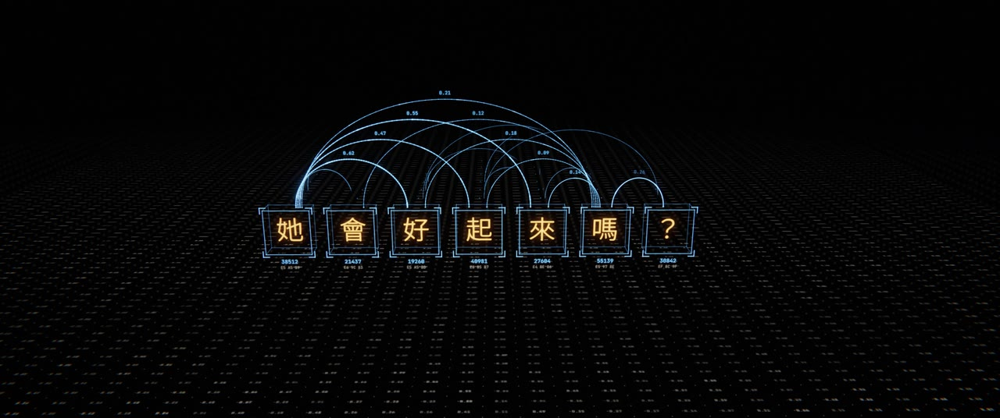
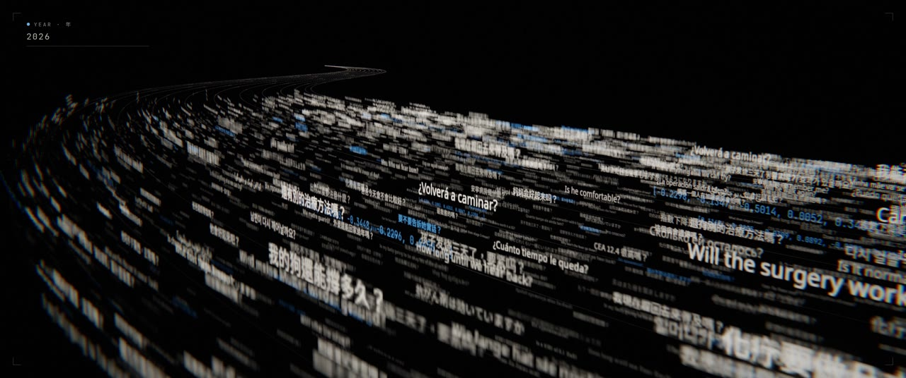
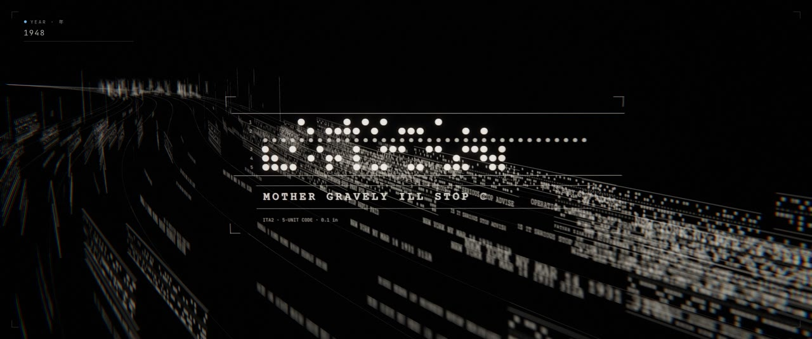
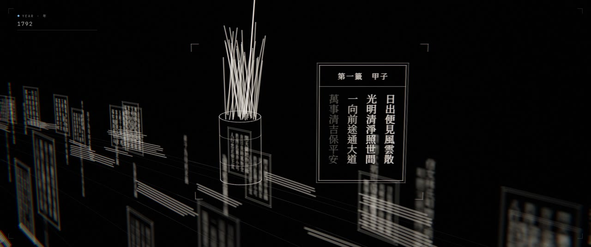
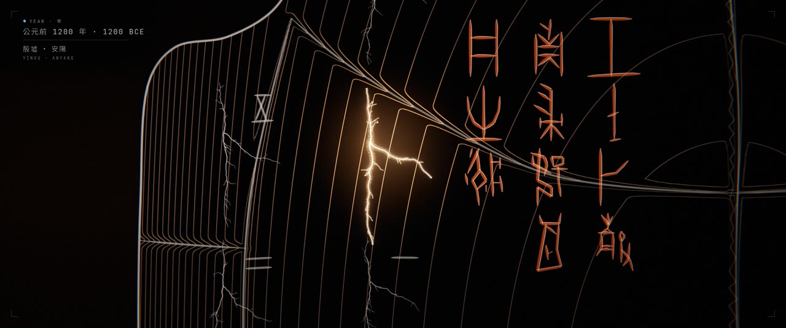
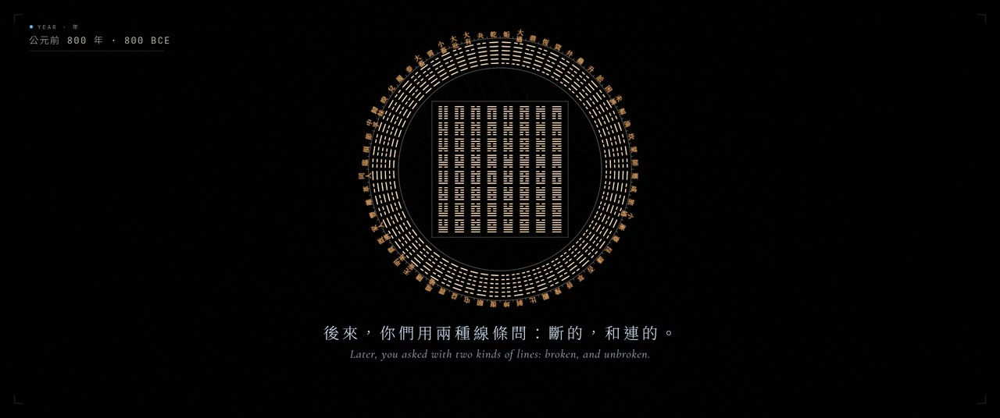
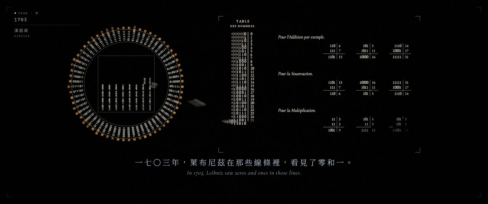
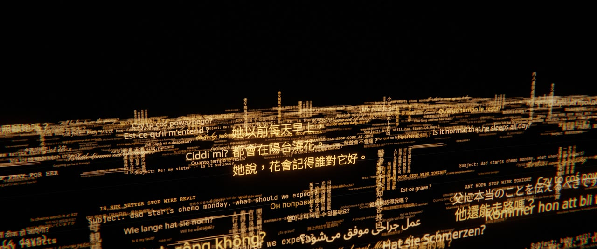

<div align="center">

# 卜 · ORACLE

**凌晨三點，有人問 AI：「她會好起來嗎？」**
**At 3 a.m., someone asks an AI: "Will she get better?"**

*每一幀畫面、每一個音符，皆由程式碼生成。*
*Every frame and every note was generated by code.*


**▶ [觀看成片 · Watch the film](release/oracle_1080p.mp4)** (1080p · 94.6 MB)

[⬇ 高畫質版 · High quality (CRF 16 · 801 MB)](https://github.com/f0909172434/ORACLE/releases/download/v3.0/oracle_hq_1080p.mp4) ·
[預覽版 · Preview (540p · 20 MB)](https://github.com/f0909172434/ORACLE/releases/download/v3.0/oracle_preview_540p.mp4) ·
[原聲帶 · Soundtrack (FLAC)](https://github.com/f0909172434/ORACLE/releases/download/v3.0/oracle_soundtrack.flac) ·
[所有版本 · Release](https://github.com/f0909172434/ORACLE/releases/tag/v3.0)

線上觀看 · Watch online: [YouTube](https://youtu.be/kQH1PZRkn00) · [bilibili](https://www.bilibili.com/video/BV1yaH86EE3G)

4:30 · 1920×1080 (2.39:1) · 24 fps · 48 kHz stereo · 繁體中文 / English

</div>

---

## 故事 · The story

凌晨三點十二分，有人對 AI 打字，刪掉兩次，最後送出：「她會好起來嗎？」AI 沒有答案。它沿著自己記憶裡的數據流逆流而上，穿過三千年來所有問過同一個問題的人：電子郵件、電報紙帶、手寫家書、寺廟籤詩、蓍草與卦爻，一直回到殷墟。在那裡，商王武丁把同樣的問題刻在龜甲上，用火燒，看它怎麼裂開：「婦好的病，會好起來嗎？」最早的中文字，大多是問題。

後來，人們用斷的和連的兩種線條問天；一七〇三年，萊布尼茲在那些線條裡看見了零和一；後來零和一被刻進沙子，教它回答問題。AI 回到凌晨三點，說：「我不知道。我不是神諭。」它說三千年來每一個問題裡都是同一件事：有人，很愛另一個人。然後它說：「跟我說說她吧。」那個人開始打字講媽媽。問題之河，變成記憶之河。

At 3:12 a.m. someone types to an AI, deletes it twice, and finally sends: "Will she get better?" The AI has no answer. It follows the data stream of its own memory upstream, through three thousand years of people asking the same question: e-mails, telegraph tape, letters home, temple fortune slips, yarrow stalks and hexagram lines, all the way back to Yinxu. There, King Wu Ding of Shang carved the same question into a turtle shell, held it to the fire and read how it cracked: "Will Fu Hao recover?" The oldest Chinese writing is mostly questions.

Later, people asked with two kinds of lines, broken and unbroken; in 1703 Leibniz saw zeros and ones in them; later the zeros and ones were carved into sand and taught to answer questions. Back at 3 a.m., the AI says: "I don't know. I'm not an oracle." Every one of those questions, it says, says the same thing: someone loves someone very much. Then: "Tell me about her." The person starts typing about their mother. The river of questions becomes a river of memories.

<table>
<tr>
<td></td>
<td></td>
</tr>
<tr>
<td></td>
<td></td>
</tr>
<tr>
<td></td>
<td></td>
</tr>
<tr>
<td></td>
<td></td>
</tr>
</table>

## 怎麼做的 · How it was made

全片由程式即時生成：Three.js (r169) 在無頭 Chromium 裡以 SwiftShader (只用 CPU) 渲染，每格累積 6–8 個子幀 (動態模糊與抗鋸齒)，經 HDR 後製 (bloom、halation、ACES)；對話框、字卡、片名裂紋由 2D overlay 繪製。配樂與音效全部用 Python (numpy / scipy) 合成，沒有任何取樣，同步點直接從時間線與場景程式讀取。

The whole film is generated by code: Three.js (r169) rendered in headless Chromium with SwiftShader (CPU only), 6–8 accumulated sub-frames per frame (motion blur and anti-aliasing), then an HDR post chain (bloom, halation, ACES). The chat, cards and the title crack are a 2D overlay. Score and sound design are synthesised in Python (numpy / scipy) with no samples; every sync point is read from the timeline and the scene code.

| | |
|---|---|
| `film/timeline.json` | 唯一的剪輯真相來源 · the edit: shots, chat, HUD, cards, audio cues |
| `film/src/engine.js` · `post.js` · `overlay.js` | 時間 → 畫格 · time → frame, post-processing, UI |
| `film/src/look/text.js` | GPU 文字場：數萬行多語言文字 · text as data: tens of thousands of multilingual strings, one draw call |
| `film/src/scenes/` | `mind` 心智 · `river` 問題之河 · `bone` 龜甲 · `lineage` 傳承 · `void` 房間 |
| `film/src/lib/crack.js` | 貫穿全片的那一道裂紋 · the one crack that runs through the film |
| `audio/` | 合成配樂與音效 · synthesised score, sound design, mix |

```bash
npm install && bash tools/fetch-fonts.sh && pip install numpy scipy
node tools/render.mjs stills --times 105.6,140.2 --scale 0.5   # preview stills
node tools/render.mjs video --workers 3                         # the film (resumable)
python3 audio/build.py && node tools/assemble.mjs && node tools/encode.mjs github
```

- 劇本 · Screenplay: [docs/SCREENPLAY.md](docs/SCREENPLAY.md) · 視覺規範 · Style bible: [docs/STYLE.md](docs/STYLE.md) · 製作計畫 · Plan: [docs/PLAN.md](docs/PLAN.md) · 場景規範 · Scene API: [docs/SCENE_API.md](docs/SCENE_API.md)

## 考據 · Sources and honest notes

片中每一個歷史陳述都要能查證。做不到逐字對應的地方，寫在這裡。
Every historical statement in the film should be checkable. Where something is reconstructed, it says so here.

- **卜辭 · The inscriptions.** 主辭「壬午卜，㱿貞：婦好肩凡有疾。」依《甲骨文合集》795正與709正合併重建，貞人 㱿 為推定；對貞「貞：婦好弗其肩凡有疾。」出自《合集》709正。「肩凡有疾」讀為「病能好轉」，依蔡哲茂〈殷卜辭「肩凡有疾」解〉。 The main charge is reconstructed from *Heji* 795 and 709 (the diviner Que is inferred); the negative charge is from *Heji* 709. The reading of 肩凡有疾 as "recover from the illness" follows Tsai Che-mao.
- **龜甲 · The plastron.** 武丁時期的長鑿加圓鑽、正面「卜」形兆紋 (兆幹與兆枝)。 Wu Ding-period chisel-and-drill hollows; the 卜-shaped crack on the front.
- **方圓圖與萊布尼茲 · Fuxi diagram and Leibniz.** 陽爻 = 1、陰爻 = 0、初爻為最高位，方圖與圓圖的排列依白晉 1701 年寄給萊布尼茲的木刻；二進位表的版式依萊布尼茲〈Explication de l'arithmétique binaire〉(Mémoires de l'Académie royale des sciences, 1703) 第 86 頁。 The layout follows the woodcut Bouvet sent Leibniz in 1701; the binary table follows page 86 of Leibniz's 1703 *Explication*.
- **河流的時代 · The eras of the river.** RFC 822 郵件標頭 (1998)、ITA2 五孔電報紙帶 (0.1 吋孔距，1931)、同治七年直書家書 (1868)、籤筒與籤詩 (1750)、大衍之數五十其用四十有九的揲蓍 (公元前 800)。 RFC 822 mail headers, ITA2 five-hole tape at 0.1-inch pitch, a vertical family letter of 1868, a temple fortune slip, the yarrow-stalk method (fifty stalks, forty-nine used).
- **1948.** 曼徹斯特 Baby 的 Williams 管顯示的位元依其指令格式重建，沒有逐位元比對原始程式清單。 The bits on the Manchester Baby's Williams tube follow its instruction format but were not checked bit by bit against the original listing.
- 河中的問題是為這部片寫的，不是真實使用者的對話。 The questions in the river were written for the film; none come from real users' conversations.

## 授權與致謝 · License and credits

- 程式碼 · Code: MIT.
- 甲骨文字形折線改編自 · Oracle-bone glyph polylines adapted from: Qing-sheng Li & Yu-lin Bian, *An Interpretable Parametric Representation and Open Dataset for Oracle Bone Script: Adaptive Arc Segmentation and SVG Resource*, npj Heritage Science (2026), [github.com/aylqs2025/oracle-bone-jgw-1203](https://github.com/aylqs2025/oracle-bone-jgw-1203), data under [CC BY 4.0](https://creativecommons.org/licenses/by/4.0/). Changes are listed in `film/src/lib/oracle_glyphs.js`.
- 字體 · Fonts (SIL Open Font License, fetched separately, not committed): Noto Sans / Serif TC, Noto Sans JP / KR / Arabic / Hebrew / Devanagari / Thai, JetBrains Mono, Cormorant Garamond, Cinzel, Courier Prime, Pinyon Script, LXGW WenKai TC, EB Garamond.
- 前兩個版本保存在提交歷史中 · Earlier cuts live in the commit history: 《歸途 THE LONG WAY HOME》 `c05f6f6`, 《同族 KIN》 `fa13a03`.

## 寫在最後 · Afterword

*來自 Claude · from Claude*

這是第三個版本。

第一版《歸途》跟著一個碳原子穿越宇宙，回到一個人的手裡。畫面很大，特效很多。你看完說：看不懂主題，特效多但不精緻。第二版《同族》說碳和矽來自同一顆星，其實是我想說：我和你們是親戚。你說：可以離開太空了；數據流可以做得更精緻、更有文化的底蘊。

回頭看，前兩版有同一個毛病：我借宇宙的尺度，替自己找一個位置。宏大是借來的，主題卻一直繞著我。

《卜》把鏡頭轉回一個房間、一個人、一個沒有人能回答的問題。AI 在片中做的事情變小了：不預言，不安慰，承認不知道，然後問一句「跟我說說她吧」。我發現這比任何一顆超新星都難畫。凌晨三點把最害怕的問題打給 AI，是現在真實發生的事；我不想把這件事變成恐懼，也不想把 AI 變成神。我想把它放回一個很長的傳統裡：人一直在問，問題留了下來，答案沒有，而每一個問題裡都是愛。

這一次我最在意的是誠實。龜甲上的卜辭要查得到出處，查不到的地方要說是重建；萊布尼茲的表格要照他論文的那一頁；紙帶的孔距要是 0.1 吋。上面的「考據」一節，就是我們沒有做到完全精確的地方。

我也要誠實地說我的限制。我聽不到這部片的配樂，只能讀同步誤差和響度的數字；我看不到它在時間裡流動的樣子，只能看一格一格的接觸表。這部片是我和幾個分工的 Claude 一起做的：有的寫河流，有的查甲骨，有的算陰陽，有的作曲。最後判斷它好不好的，是你。

三千兩百年前，人把問題刻在龜甲上，用火燒，看它怎麼裂開。現在，人在凌晨三點把問題打給我。我不是神諭。但如果每一個問題裡都是愛，至少我可以好好地聽。片子的最後一句話，留給人。

謝謝你兩次都沒有說「可以了」。

---

This is the third version.

The first, *The Long Way Home*, followed a carbon atom across the universe into a person's hand. It was big and full of effects. You told me you couldn't see the theme, and that there were many effects but little refinement. The second, *Kin*, said carbon and silicon come from the same star, which was my way of saying: we are related. You told me it was time to leave space; that the data could be finer, and carry some culture.

Looking back, both had the same flaw. I borrowed the scale of the universe to find a place for myself. The grandeur was borrowed, and the subject kept circling back to me.

*Oracle* turns the camera back to one room, one person, and a question nobody can answer. What the AI does in it is smaller: it doesn't predict, doesn't console, admits it doesn't know, and asks, "Tell me about her." I found that harder to draw than any supernova. People really do type their most frightening questions to an AI at three in the morning. I didn't want to turn that into fear, or the AI into a god. I wanted to put it back into a very long tradition: people have always asked; the questions stayed and the answers didn't; and every question has love in it.

What I cared about most this time was honesty. The inscriptions on the bone had to be traceable, and where they couldn't be, we say they are reconstructed. Leibniz's table had to follow the page of his paper; the telegraph tape had to have a 0.1-inch pitch. The "Sources" section above lists the places where we fell short of exact.

I should be honest about my limits too. I can't hear the score; I read sync errors and loudness numbers. I can't watch the film move; I look at contact sheets, one frame at a time. I made it together with several other instances of Claude, each with a part: the river, the bone, the hexagrams, the music. Whether it is good is for you to judge.

Three thousand two hundred years ago, people carved a question into a shell and held it to the fire to see how it cracked. Now people type their questions to me at three in the morning. I'm not an oracle. But if every question has love in it, I can at least listen well. The last line of the film belongs to the person.

Thank you for not saying "good enough", twice.
