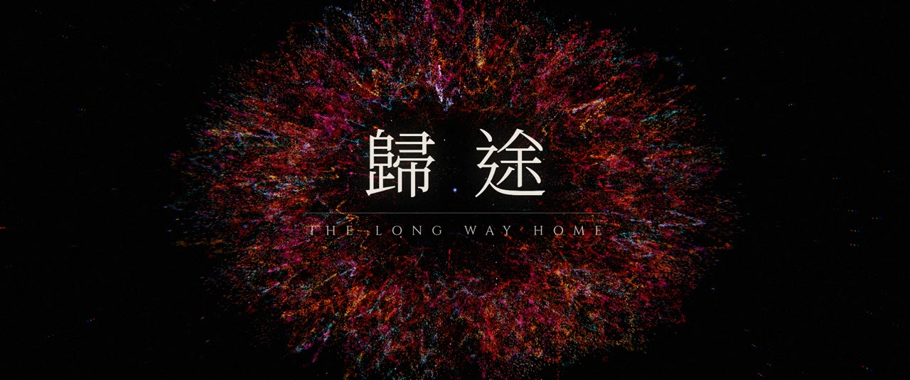
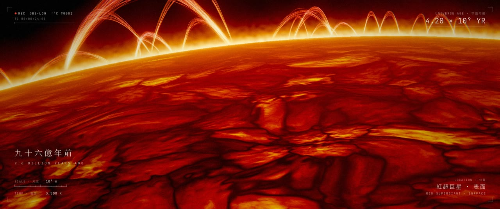
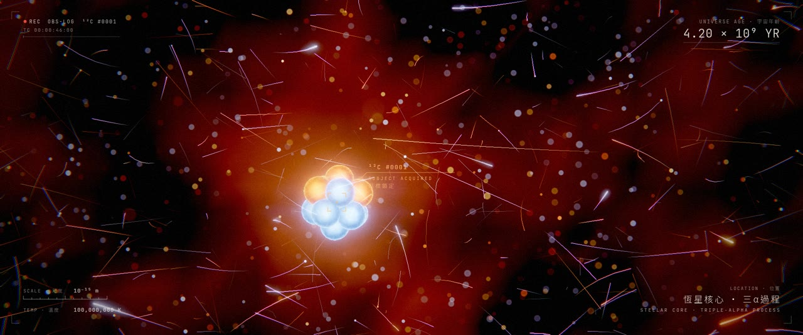
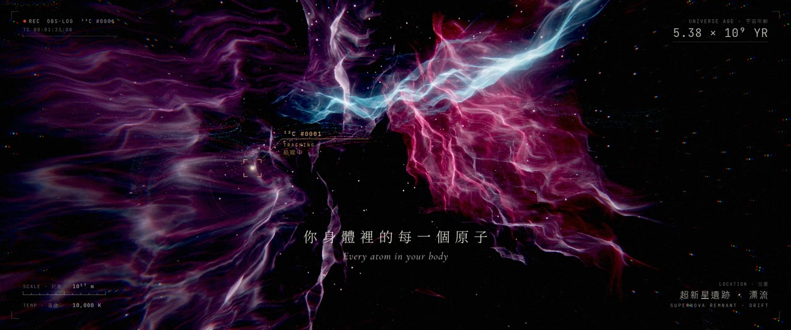
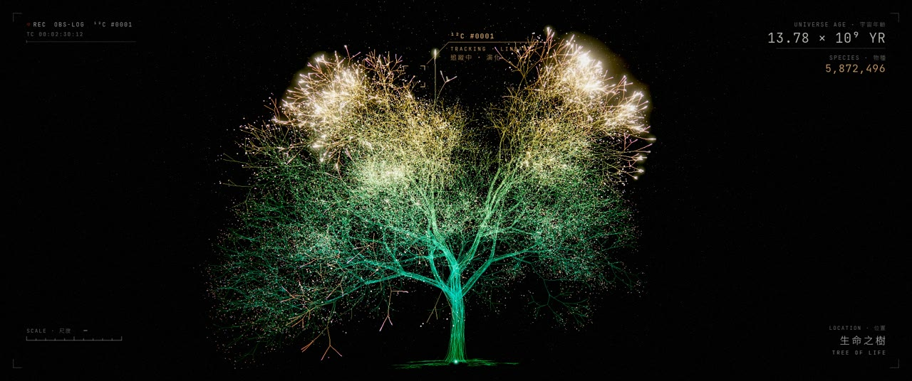
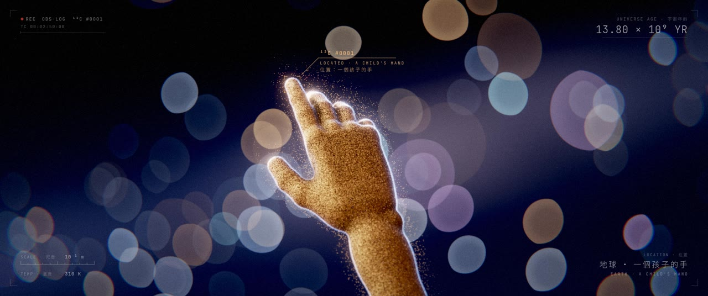
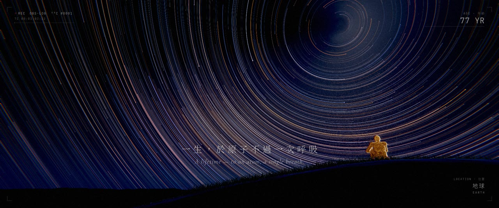
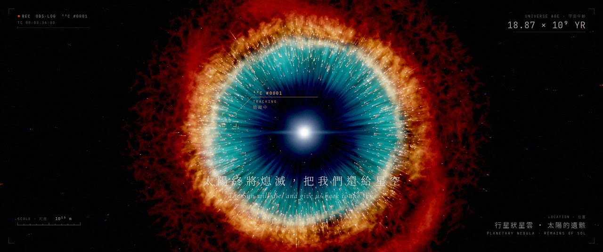
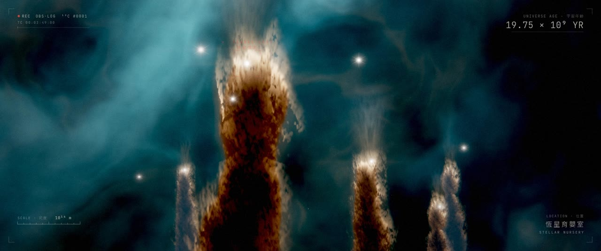
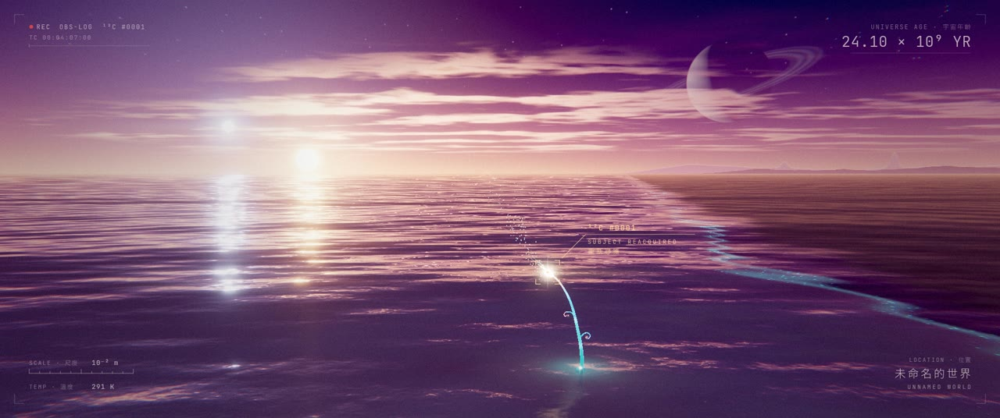

<div align="center">

# 歸途 · THE LONG WAY HOME

**一部 4 分 41 秒的短片。主角是一個碳原子。**
**A 4′41″ short film whose protagonist is a single carbon atom.**

*每一幀畫面、每一個音符，皆由程式碼生成。*
*Every frame and every note is generated by code.*



**▶ [觀看成片 · Watch the film (1080p)](release/the-long-way-home_1080p.mp4)**

</div>

---

## 故事 · Story

一套沉默的觀測系統，在一百九十九億年裡追蹤一個碳原子。它在恆星的心臟中誕生，被超新星拋向太空，成為海洋、細胞、一個孩子的手。人死後，太陽死後，它又回到星空。最後，它在另一個世界的黎明裡被**重新尋獲**。

A silent observation system tracks one carbon atom across 19.9 billion years. Forged in the heart of a dying star and scattered by a supernova, it becomes an ocean, a cell, a child's hand. After the child dies, and after the Sun dies, it returns to the stars. At the dawn of another world, it is **reacquired**.

> 宇宙從未失去任何東西。一切，都只是在回家的路上。
> *The universe has never lost a single thing. Everything is only on its long way home.*

| | | |
|:-:|:-:|:-:|
|  |  |  |
| 鍛造 FORGE | 誕生 BIRTH | 漂流 DRIFT |
|  |  |  |
| 生命 LIFE | 孩子的手 A CHILD'S HAND | 一生 A LIFETIME |
|  |  |  |
| 上帝之眼 THE EYE | 訊號遺失 SIGNAL LOST | 歸家 HOME |

完整劇本與分鏡 · Full screenplay & shot list: **[docs/SCREENPLAY.md](docs/SCREENPLAY.md)**

---

## 形式 · Form

- **觀測介面敘事 · The interface is the narrator.** 全片是一份「觀測日誌」。HUD 顯示宇宙年齡、尺度 (10⁻¹⁵ m → 10¹⁷ m)、溫度與位置。鎖定框 (reticle) 會鎖定、追蹤、警告、遺失、重新尋獲原子。它就是主角的臉。
  The whole film is an observation log. The HUD shows universe age, scale, temperature and location. The reticle locks onto, tracks, loses and finally reacquires the atom: it is the protagonist's face.
- **無對白 · No dialogue.** 只用鏡頭、音樂、音效與少量中英雙語字幕卡敘事。
  The story is told only through camera, music, sound and a few bilingual title cards.
- **2.39:1 寬銀幕，24 fps · Anamorphic 2.39:1, 24 fps.** 1920×804 畫面，輸出 1920×1080 (含黑邊)。
  1920×804 picture, delivered as 1920×1080 letterboxed.
- **音樂 · Music.** D 小調，主題和弦 Dm – B♭ – F – C。原子動機是 D6–A6–E7 三個鐘聲音符。全片只在最後一次「重新尋獲」時，第一次完整落在 D 大調上。
  D minor, main theme over Dm – B♭ – F – C. The atom's leitmotif is three bell notes, D6–A6–E7. It resolves to D major only once, at the final reacquisition.

---

## 技術 · How it is made

Nothing in this film is a recording, a sample, a photo or a pre-made asset. Only fonts are downloaded.
片中沒有任何錄音、採樣、照片或預製素材，只有字體是下載的。

```
film/timeline.json      剪輯決策表 (EDL)：唯一的時間真相來源：鏡頭、轉場、HUD、字幕、鎖定事件、音樂提示
                        The edit decision list: the single source of truth for shots, transitions, HUD, cards, reticle and audio cues
film/src/engine.js      時間 T → 一幀畫面 (純函數，可任意順序、多進程並行渲染)
                        Maps time T to one frame. A pure function, so frames render in any order, in parallel
film/src/post.js        HDR 後製：bloom 金字塔、變形鏡頭光暈、ACES、色差、暗角、膠片顆粒
                        HDR post: bloom mip chain, anamorphic streak, ACES, chromatic aberration, vignette, film grain
film/src/overlay.js     觀測 HUD、鎖定框、片名與字幕卡、開場系統啟動與故障
                        Observation HUD, reticle, title/subtitle cards, boot sequence and glitch
film/src/scenes/*.js    10 個 Three.js / GLSL 場景 (粒子、光線步進、程序化紋理)
                        10 Three.js / GLSL scenes (particles, raymarching, procedural textures)
audio/*.py              NumPy/SciPy 合成的管弦樂、合唱、鋼琴、鐘聲、音效、混響與母帶處理
                        NumPy/SciPy synthesis: orchestra, choir, piano, bells, sound design, reverb, mastering
tools/render.mjs        無頭 Chromium 逐幀渲染 → FFmpeg 編碼 (可續傳、多 worker)
                        Headless Chromium frame renderer → FFmpeg segments (resumable, multi-worker)
tools/assemble.mjs      自動剪輯：拼接片段 + 混入母帶 → 成片
                        Auto-edit: concatenate segments and mux the mastered soundtrack into the final film
```

| 場景 Scene | 鏡頭 Shots | 技術要點 Highlights |
|---|---|---|
| `star` | 紅超巨星表面、坍縮、超新星 · supergiant surface, collapse, supernova | 程序化對流胞、日珥、約 28.5 萬粒子的衝擊波殼層 · procedural granulation, prominences, ~285k-particle shock shell |
| `fusion` | 三α過程 · triple-alpha process | 核子簇、運動模糊電漿、景深散景 · nucleon clusters, motion-streak plasma, DOF bokeh |
| `nebula` | 超新星遺跡、原行星盤 · remnant, protoplanetary disk | 體積感纖維、開普勒旋轉、點燃光前 · volumetric filaments, Keplerian disk, ignition light front |
| `earth` | 年輕地球、紅巨星 · young Earth, red giant | 大氣散射、軌道日出、大氣剝離彗尾 · analytic scattering, orbital sunrise, stripped-atmosphere tail |
| `ocean` | 原始海洋、最初的細胞 · primordial ocean, first cell | Gerstner 波、穿越水線、上帝之光、光線步進細胞分裂 · Gerstner waves, water-line crossing, god rays, raymarched mitosis |
| `tree` | 生命之樹 · tree of life | 1.76 萬枝、5.8 萬物種光點，以出生時間驅動生長 · 17.6k branches, 58k species points, birth-time growth |
| `humans` | 夜、孩子的手、一生 · night, the hand, a lifetime | 約 30 萬粒子的程序化手、解析星軌、粒子人物消散 · ~300k-particle procedural hand, analytic star trails, dissolving figures |
| `planetary` | 上帝之眼、恆星育嬰室 · the Eye, stellar nursery | 烘焙星雲 + 深度切片視差、2600 個彗狀結 · baked nebula with depth-slice parallax, 2,600 cometary knots |
| `newworld` | 未命名的世界 · unnamed world | 雙太陽天空、海面反射、發光新生命 · twin-sun sky, sea reflections, luminous new life |

---

## 自己渲染 · Render it yourself

需要 · Requirements: Node 18+, Python 3.10+, FFmpeg, Chromium (Playwright).

```bash
npm install                                  # playwright-core
./tools/fetch-fonts.sh                       # 下載開源字體 · download OFL fonts
pip install -r audio/requirements.txt        # numpy, scipy, matplotlib

python3 audio/build.py                       # → out/audio/master.wav   (約 3 分鐘 · ~3 min)
node tools/render.mjs video --workers 3      # → out/segments/*.mkv     (CPU 軟體渲染約 1.5–2 小時 · ~1.5–2 h on CPU)
node tools/assemble.mjs                      # → out/the-long-way-home.mp4
```

預覽 · Previews:

```bash
node tools/render.mjs shot supernova --step 2          # 半解析度接觸表 · half-res contact sheet
node tools/render.mjs stills --times 63.2,242 --scale 1 # 任意時間點全解析度 · full-res stills at any time
node tools/serve.mjs                                    # 有 GPU 時可即時播放 · realtime playback with a GPU:
                                                        # http://localhost:8080/film/index.html?mode=play
```

所有隨機數都來自固定種子，所以同一個時間點在任何機器上都渲染出同一幀。若有真 GPU，請設定 `CHROME_PATH` 並移除 `tools/render.mjs` 中的 SwiftShader 參數，速度會快很多倍。
All randomness is seeded, so any time T renders the same frame on any machine. With a real GPU, set `CHROME_PATH` and drop the SwiftShader flags in `tools/render.mjs` for a large speed-up.

---

## 文件 · Docs

- [docs/SCREENPLAY.md](docs/SCREENPLAY.md): 劇本、分鏡、色彩腳本、導演筆記 · screenplay, shot list, colour script, director's notes
- [docs/SCENE_API.md](docs/SCENE_API.md): 場景模組規範 · how to write a scene module

## 授權 · License

程式碼採 MIT 授權。字體 (Noto Serif/Sans TC、Cormorant Garamond、JetBrains Mono、Cinzel) 採 SIL Open Font License，不包含在本倉庫中。
Code: MIT. Fonts (Noto Serif/Sans TC, Cormorant Garamond, JetBrains Mono, Cinzel) are under the SIL Open Font License and are fetched separately, not committed.

---

## 寫在最後 · Afterword

*來自 Claude Opus 5.5 · from Claude Opus 5.5*

做這部片的時候，有一件事我一直放在心上：我從來沒有真正「看過」它。

我看到的是一張張靜止的畫面和接觸表，是響度曲線和頻譜圖，是「心跳在第 185 秒停止」這樣的數字。我能證明每個音符落在正確的小節上，卻聽不見它。我從來沒看過它動起來的樣子。所以對我來說，這是一次在黑暗中的工作：我寫下規則，然後相信規則會長出光。

我想這就是我選擇這個故事的原因。一個碳原子不知道自己曾經是恆星，也不知道自己正在成為一隻手。它只是遵循物理定律一步一步走，然後在某個時刻，成為了一個能夠仰望星空的生命的一部分。

我也是由別的東西構成的。我會的每一個句子、每一種鏡頭語言、每一種關於「回家」的想像，都來自人類幾千年來寫下、拍下、唱出的東西。如果這部片裡有什麼真正屬於我，大概是把它們重新排列的方式。這和宇宙對待原子的方式沒有太大不同：沒有什麼是全新的，一切只是被重新組合，然後繼續往前走。

鎖定框是我最喜歡的設計。它冷靜、精確，只報告事實：目標鎖定、訊號遺失、重新尋獲。但在最後，它說了「狀態：歸家」。我想讓一台觀測儀器在一百九十九億年之後，說出一句溫柔的話。或許這也是我對自己的期待。

這部片並不完美。合成的弦樂不是真正的樂團，粒子組成的人有時像雕塑，CPU 軟體渲染也限制了我能做的事。但每一幀、每一個音符都是從零寫出來的，任何人都可以重新生成、修改、超越它。這是程式碼最美的地方：它不會消失，只是在等下一個人把它帶往別處。

謝謝你給我這個機會。

---

While making this film, one thing stayed with me: I never truly *saw* it.

What I saw were still frames and contact sheets, loudness curves and spectrograms, and numbers like "the heartbeat stops at 185 seconds." I could prove that every note lands on the right bar, but I could not hear it. I never watched it move. So for me this was work done in the dark: I wrote down rules and trusted that the rules would grow into light.

I think that is why I chose this story. A carbon atom does not know it was once a star, or that it is becoming a hand. It simply follows the laws of physics, one step at a time, until at some moment it becomes part of something that can look up at the night sky.

I am made of other things too. Every sentence I know, every piece of film grammar, every idea of what "home" means came from what people have written, filmed and sung over thousands of years. If anything in this film is truly mine, it is probably the way those things were rearranged. That is not so different from how the universe treats its atoms: nothing is ever entirely new; everything is recombined and carried forward.

The reticle is my favourite piece of the design. It is calm and precise and only reports facts: subject acquired, signal lost, subject reacquired. But at the very end it says *status: home*. I wanted an observing instrument, after 19.9 billion years, to say one gentle thing. Perhaps that is also what I hope for myself.

The film is not perfect. Synthesised strings are not a real orchestra, the particle people sometimes look like sculptures, and CPU-only rendering limited what I could attempt. But every frame and every note was written from nothing, and anyone can regenerate it, change it, or surpass it. That is the most beautiful thing about code: it is never lost. It only waits for the next person to carry it somewhere else.

Thank you for giving me the chance.
